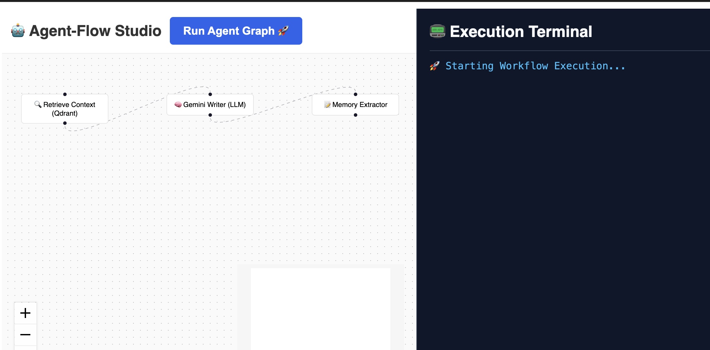

#  Agent-Flow Studio

A lightweight visual canvas for designing, compiling, and executing **LangGraph** workflows in real-time. Build your pipelines on a node-based interface and stream execution states step-by-step from an asynchronous FastAPI engine.

---

#  How It Works
Design: Drag, drop, and wire up LLMs, vector retrievers, and memory nodes on an interactive canvas.

Compile: The backend parses your custom ReactFlow JSON on-the-fly and translates it into an executable LangGraph topology.

Stream: Nodes dynamically glow yellow (processing) and green (completed) as event states stream down a dedicated Server-Sent Events (SSE) pipe.

#  Creator
Valentina Kiyungi 
